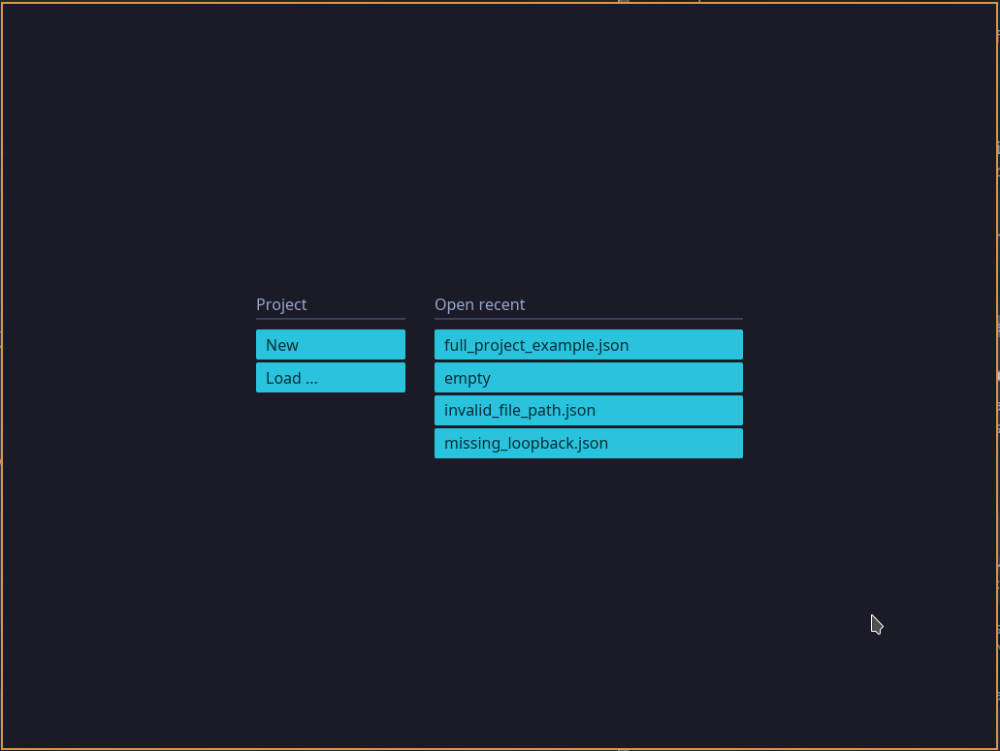

# Raumklang

An open source room impulse response measurement software using the sine sweep
method.

## The Goal

The goal is to create a fully open source room impulse response measurement
software with first class support of the Linux audio drivers (currently Jack
only).

## Current State

The project started as a sandbox to learn more about DSP and room impulse
response measurement in general. Currently, There is a [CLI app](raumklang-cli) to produce
different kinds of signals and perform basic room impulse response measurements.
At the moment most work is done on the [GUI app](raumklang-gui) with the goal to
introduce basic features to analyse room impulse response measurements. In the
end common features will land in the projects [core library](raumklang-core).

## Contributing

### Developers

If you'd like to contribute, please fork the repository and use a feature
branch. Pull requests are warmly welcome. 

### Future Users

If you are interested on using an open source room impulse measurement software
in the future, do not hesitate and open an issue describing your interest,
feature ideas or anything else you think might be useful for the project.

## License

The code in this project is licensed under [MIT license](LICENSE).
